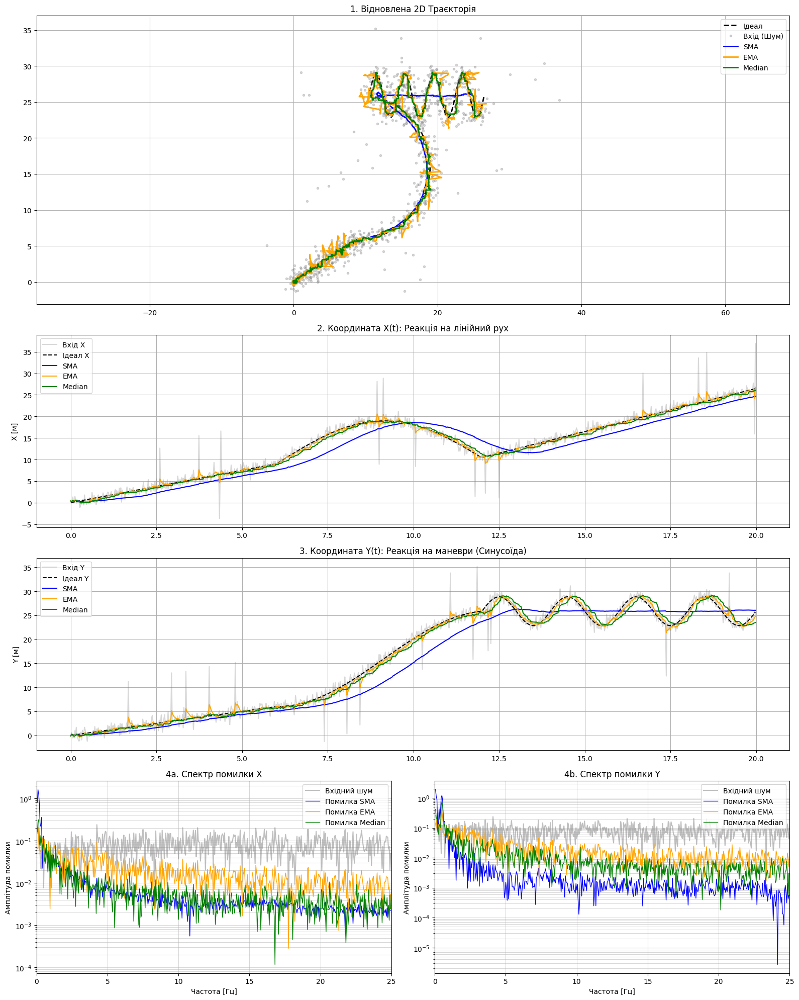

# Лабораторна робота №5: Обробка координатних даних (Придушення шумів у потоці)
# Панченко Даниїл, ІПЗ-4.01

## 1. Реалізація фільтрів
У ході роботи було реалізовано три типи цифрових фільтрів для потокової обробки даних: SMA (Simple Moving Average), EMA (Exponential Moving Average) та Median Filter. 

Для забезпечення ефективності роботи мікроконтролера в режимі real-time, фільтр SMA був оптимізований: замість перерахунку суми всього вікна на кожному кроці (складність O(N)), використовується двостороння черга (`deque`), де від поточної суми віднімається найстаріший елемент і додається новий (складність O(1)). Медіанний фільтр реалізовано з використанням сортування вікна непарного розміру.

---

## Експеримент 1 (Базовий)
**Параметри:** `W_SMA = 20`, `A_EMA = 0.1`, `W_MED = 21`.

### Аналіз графіків (Відповіді на питання):

**1. Чи сильно лінії фільтрів відстають від чорного пунктиру (Ідеалу) на маневрах ("змійці")?**
Так, на Графіку 3 (Y) у період 12-20 секунд чітко помітне відставання (фазовий зсув) відфільтрованих ліній від чорного пунктиру ідеальної траєкторії. Піки синьої (SMA) та помаранчевої (EMA) ліній відбуваються помітно пізніше за піки ідеальної кривої. Це явище називається затримкою (Lag). Воно виникає через те, що обидва ці фільтри розраховують поточне положення, спираючись на "історію" попередніх вимірювань (у вікні або через ваговий коефіцієнт), тому вони завжди фізично "наздоганяють" реальний рух. Затримка для SMA становить приблизно $W/2$ відліків.

**2. Як медіанний фільтр впорався з поодинокими "викидами" (різкі піки сірого кольору)? Порівняйте з SMA та EMA.**
Медіанний фільтр (зелена лінія) впорався з різкими аномальними викидами ідеально. Як видно на часових графіках (2 та 3), коли трапляється гігантський сірий пік, зелена лінія його повністю ігнорує і залишається на правильній траєкторії. 
Натомість SMA (синя лінія) та EMA (помаранчева лінія) є лінійними фільтрами. Коли величезне значення викиду бере участь у їхньому розрахунку, воно критично спотворює середнє арифметичне. Через це на синій та помаранчевій лініях у місцях викидів утворюються помітні "горби" — помилка "розмазується" на всі наступні точки, поки аномальне значення не вийде з пам'яті фільтра.

---

## Експеримент 2 (Екстремальне згладжування)
**Параметри:** `W_SMA = 100`, `A_EMA = 0.02`, `W_MED = 21`.

 

### Аналіз графіків (Відповіді на питання):

**1. Знайдіть зону низьких частот (0 - 1 Гц) на Графіку 4b. Що сталося з кольоровими лініями помилки? Чи стали вони вищими за сіру лінію (вхідний шум)?** 
Так, на графіку спектру помилки (4b) у зоні дуже низьких частот (від 0 до 1 Гц) синя (SMA) та помаранчева (EMA) лінії піднялися значно вище за сіру лінію вхідного шуму. Це означає, що на цих частотах фільтри не покращили сигнал, а навпаки — внесли в нього більшу помилку, ніж була від самого шуму сенсора.

**2. Поясніть цей феномен: чому придушення шуму призвело до збільшення помилки на низьких частотах?** 
Цей парадокс є класичним компромісом (trade-off) у цифровій обробці сигналів. Встановивши екстремальні параметри (`W_SMA = 100`, `A_EMA = 0.02`), ми зробили фільтри дуже "інерційними". 
Спектр показує, що ці фільтри ідеально придушили високочастотне "тремтіння" (у правій частині графіка кольорові лінії лежать низько). Однак, через занадто велику "вагу" минулих значень, фільтри стали занадто повільними. На графіку часової області видно, що вони фізично не встигають за реальними маневрами об'єкта, сильно зрізаючи кути на "змійці" та створюючи величезну затримку (Lag). 
Саме це структурне викривлення самої траєкторії руху відображається як величезний "горб" помилки на низьких частотах. Висновок: надмірне згладжування руйнує корисний низькочастотний сигнал (динаміку руху).

---

## Експеримент 3 (Медіанний фільтр)
**Параметри:** `W_SMA = 20`, `A_EMA = 0.1`, `W_MED = 5`.

 

### Аналіз графіків (Відповіді на питання):

**1. Чи зникли "широкі" викиди (якщо шум триває кілька точок підряд)?** 
Медіанний фільтр з вікном $W=5$ здатний ідеально пригнічувати викиди, які тривають не більше 2 відліків підряд (оскільки вони становлять меншість у вікні з 5 елементів). Однак, якщо шум формує "широкий" викид тривалістю 3 і більше точок підряд, він перестає бути аномалією для цього вікна і стає математичною більшістю (медіаною). У такому випадку "широкий" викид не зникне, а пройде крізь фільтр, утворивши на графіку помітну сходинку. 

**2. Порівняйте гладкість лінії Median з лінією SMA при аналогічному вікні.** 
Навіть якби ми встановили для SMA таке ж мале вікно (W=5), лінія Median (зелена) все одно виглядала б менш гладкою. Це добре видно на графіках 2 та 3: зелена лінія є досить "рубленою" та "східчастою". Це фундаментальна відмінність алгоритмів. SMA створює нові значення шляхом усереднення, розгладжуючи "білий шум". Медіанний фільтр не вираховує середнє, він просто вибирає одне з існуючих зашумлених значень з вікна. Тому він ідеально відкидає гігантські одиничні викиди, але гірше справляється зі звичайним дрібним тремтінням сенсора.

---

## Загальний висновок
На основі проведених експериментів можна зробити висновок, що ідеального фільтра не існує, і вибір залежить від характеру завад: 

* **(а) Для видалення збоїв сенсора (викидів/outliers):** Беззаперечним лідером є **Медіанний фільтр**. Він здатний повністю ігнорувати екстремальні помилки датчиків, не спотворюючи при цьому загальну математику траєкторії.
* **(б) Для плавного ведення траєкторії:** Краще використовувати лінійні фільтри — **SMA** або **EMA**. Вони добре пригнічують рівномірний Гауссів шум і дають гарну гладку лінію, але вимагають обережного налаштування розміру вікна (або коефіцієнта згладжування), щоб знайти правильний компроміс між гладкістю лінії та динамічними спотвореннями (затримкою реального сигналу).
